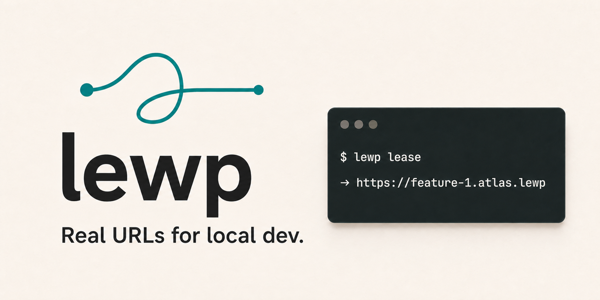

# Lewp

Lewp is a macOS-first local domain router/proxy for parallel local development.
It leases stable loopback ports, assigns predictable `.lewp` hostnames, and
reverse-proxies browser traffic to developer-started processes.

Lewp is not a process manager. It never starts Rails, Vite, Next, Docker, or any
other app process.

## Install

Release install:

```sh
curl -fsSL https://raw.githubusercontent.com/scottwater/lewp/main/install.sh | bash
```

Or with Go:

```sh
go install github.com/scottwater/lewp/cmd/lewp@latest
```

Or from a local checkout:

```sh
git clone <repo-url> lewp
cd lewp
bin/reinstall
```

This installs to `~/.local/bin/lewp` by default. Make sure `~/.local/bin` is in
your `PATH`. Override with `LEWP_INSTALL_DIR=/some/bin`.

Requirements:

- macOS
- Go 1.25+
- permission to install a LaunchAgent and trust a local development CA

## Setup

Run one-time setup:

```sh
lewp setup
lewp system start
```

`setup` writes `/etc/resolver/lewp`, creates Lewp's local CA files under
`~/Library/Application Support/lewp/`, writes the LaunchAgent plist, and trusts
the CA with macOS `security`.

Expect two prompts during `setup`:

- **sudo**: installing `/etc/resolver/lewp` needs root, so `setup` runs `sudo`
  and macOS may prompt for your password.
- **keychain trust**: trusting the local CA may pop a macOS dialog asking you to
  allow the change to your keychain.

If a step fails, `setup` prints the exact failing command and a `Next:` line with
how to recover (for example, the precise `security add-trusted-cert` command to
run by hand). `system start` runs the launchd bootstrap command; if the
LaunchAgent is already loaded, it falls back to `launchctl kickstart -k`. Daemon
logs are written under `~/Library/Logs/lewp/`.

Check the installed build with:

```sh
lewp version
```

Upgrade release installs with:

```sh
lewp upgrade
lewp system restart
```

## Release Versioning

Release versions come from git tags. There is no checked-in version file to
update before a release; `internal/buildinfo` only contains fallback values for
unstamped local builds.

To publish a release from the current committed state:

```sh
go test ./...
git tag v0.1.0
git push origin v0.1.0
```

Pushing a `v*` tag runs the GitHub release workflow. GoReleaser builds the
macOS artifacts and injects the tag version into the binary, so release
artifacts from `v0.1.0` report `lewp version 0.1.0`. New installs and
`lewp upgrade` use the latest GitHub release.

## Quick Start

From a project instance directory:

```sh
cd ~/projects/atlas/feature-1
lewp lease
```

Example output:

```sh
PORT=42137
URL=http://feature-1.atlas.lewp
HTTPS_URL=https://feature-1.atlas.lewp
HOST=feature-1.atlas.lewp
STATE=new
HOST_KIND=instance
```

`lease` always prints both the HTTP `URL` and the `HTTPS_URL` whenever the lease
has a host. Whether the browser accepts the HTTPS one depends on `lewp setup`
having trusted the local CA (see [HTTPS](#https)): `.lewp` hosts and configured
safe-subtree custom suffixes both get browser-trusted certificates; domain-mirror
suffixes stay HTTP-only. `STATE` and `HOST_KIND` are descriptive; use
`--shell` for clean `export` lines (which omit them) when you want
`eval "$(lewp lease --shell)"`.

Start your app yourself on the leased port:

```sh
PORT=42137 <your dev command>
```

Then open either scheme:

```text
http://feature-1.atlas.lewp
https://feature-1.atlas.lewp
```

Add extra hostnames for the same app process with `alias`. Aliases attach to
the current route and reuse its port; they do not create another route or start
another process:

```sh
lewp alias add tags.feature-1.atlas.lewp
lewp alias add '*.feature-1.atlas.lewp'
lewp alias list
```

Wildcards match one label only. `*.feature-1.atlas.lewp` matches
`tags.feature-1.atlas.lewp`, but not `feature-1.atlas.lewp` or
`api.tags.feature-1.atlas.lewp`.

Check or relocate a route later:

```sh
lewp info                                     # this directory's route and ports
PORT="$(lewp info --host feature-1.atlas.lewp --port)"
lewp move --from ~/projects/atlas/feature-1   # bring its route, aliases, and port here
```

Release the current directory with `lewp release`, or target another registered
owner without changing directories:

```sh
lewp release
lewp release --path /work/deleted-worktree
lewp release --path /work/app --name vite
lewp release --host app.work.lewp
lewp release --host '*.app.work.lewp'
lewp release --port 42137
```

Host and numeric-port selectors match current owners. An exact path also works
after you delete or move that directory. To review a subtree before changing
it, run:

```sh
lewp release --path /work/worktrees --recursive --dry-run
lewp release --path /work/worktrees --recursive --yes
```

The dry run never prompts or changes the registry. An interactive recursive
change without `--yes` previews all matches and asks for confirmation. Human
output with `--yes` keeps the preview but skips the prompt. Noninteractive
recursive changes require `--yes` or `-y`. Recursive JSON changes require
`--yes` and write one JSON object without a human preview or prompt. Release
keeps registry history unless you add `--forget`.

## Identity and configuration

A route's hostname is `<name>.<root>.lewp`. Lewp resolves `root`, `name`, and an
optional explicit `host` from the first source that provides each, in priority
order:

1. **Flags** — `lewp lease --root atlas --name feature-1 --host atlas.lewp`
2. **Environment** — `LEWP_ROOT`, `LEWP_NAME`, `LEWP_HOST`
3. **Config file** — the nearest `.lewp.local.toml` up the directory tree
4. **Inference** — parent directory → `root`, current directory → `name`

The environment variables are read from the CLI process and forwarded to the
daemon (the daemon never reads its own environment), so they work per-shell:

```sh
LEWP_ROOT=atlas LEWP_NAME=feature-1 lewp lease
export LEWP_HOST=sso.atlas.lewp     # pin an explicit host for this shell
```

Passing `--root`, `--name`, or `--host` to `lewp lease` is remembered for that
directory. Use `lewp lease --reset` to clear those remembered route overrides and
re-resolve from flags, environment, config, and inference while keeping the same
port, aliases, and route history. Combine it with a flag to keep one value:

```sh
lewp lease --reset --root atlas
```

For a stable, path-independent identity, write a `.lewp.local.toml` with
`lewp init`:

```sh
lewp init --root atlas --name feature-1
# writes ./.lewp.local.toml and prints a .git/info/exclude line to keep it local
```

```toml
root = "atlas"
name = "feature-1"
host = "atlas.lewp"   # optional explicit host
```

`lewp init` only writes the file; it never contacts the daemon or leases
anything. The file is meant to stay uncommitted — `init` prints the
`.git/info/exclude` line that keeps it out of version control. Re-run with
`--force` to overwrite an existing file (rebuilt from flags and inference, never
from the file being replaced).

### Custom public dev suffixes

`.lewp` remains the default. For OAuth providers that reject private TLDs, use
an owned public-domain subtree:

```sh
lewp setup --suffix local.todoordie.com
lewp lease --host feature-1.local.todoordie.com
```

Lewp installs a resolver only for the configured subtree. With
`local.todoordie.com`, `todoordie.com` and `www.todoordie.com` continue to use
normal DNS. This is the default safe-subtree mode. Custom suffixes must be below
a registrable domain; apex domains such as `todoordie.com` and
`todoordie.co.uk` are rejected unless you explicitly choose domain mirror mode.

Domain mirror mode is for local mirrors of an owned public domain:

```sh
lewp setup --suffix localkickofflabs.com --allow-domain-mirror
lewp lease --host localkickofflabs.com
lewp alias add app.localkickofflabs.com
lewp alias add leads.localkickofflabs.com
```

While the resolver file exists, that suffix shadows public DNS on this Mac.
Proxy routing is still host-based: create the primary route once with `lewp lease`,
then attach any same-app hostnames with `lewp alias add`. After adding a suffix,
run `lewp system start` (or `lewp setup --suffix localkickofflabs.com --allow-domain-mirror --start`)
so the daemon kickstarts and loads the updated suffix list.

Safe-subtree custom suffixes support HTTPS through Lewp's local CA, the same as
`.lewp` hosts, once `lewp setup` has run for that suffix. Domain-mirror
suffixes stay HTTP-only — Lewp's CA is cryptographically unable to sign a real
registrable domain.

## Route aliases

One app process can serve multiple local hostnames through the same Lewp route.
Create the route once, start the app on that port, then add aliases:

```sh
lewp lease
lewp alias add tags.app.lewp
lewp alias add leads.app.lewp
lewp alias add '*.app.lewp'
```

Aliases reuse the current directory's active route and port. They never allocate
a second app port. Wildcards match exactly one label: `*.app.lewp` matches
`tags.app.lewp`, but not `app.lewp` or `foo.tags.app.lewp`.

For public-domain aliases, first configure the managed suffix with
`lewp setup --suffix ...`; use `--allow-domain-mirror` only when you
intentionally want to shadow that domain locally.

## Worktree walkthrough

Lewp shines with `git worktree`, where each checkout needs its own stable URL
and ports. Suppose your worktrees live somewhere non-standard — not under a
tidy `atlas/<name>` layout:

```sh
cd ~/scratch/wt/atlas-login-fix          # a worktree checkout
lewp lease
# inferred root=wt name=atlas-login-fix      (note on stderr)
# PORT=42150
# URL=http://atlas-login-fix.wt.lewp
# HTTPS_URL=https://atlas-login-fix.wt.lewp
# HOST=atlas-login-fix.wt.lewp
# STATE=new
# HOST_KIND=instance
```

If the inferred `root`/`name` are not what you want, pin them explicitly so the
host is predictable regardless of where the worktree lives:

```sh
lewp init --root atlas --name login-fix
lewp release --path ~/scratch/wt/atlas-login-fix --route --forget
lewp lease
# login-fix.atlas.lewp
```

If two worktrees infer the same host, the second is given a deterministic
suffix instead of stealing the first owner; pin distinct names (above) to avoid
the suffix. Start your app on the leased port, then inspect and, after moving the
worktree, relocate the route so its URL follows it:

```sh
PORT=42150 <your dev command>                 # Lewp routes; it never starts apps
lewp info                                      # this directory's route and ports

git worktree move ~/scratch/wt/atlas-login-fix ~/projects/atlas/login-fix
cd ~/projects/atlas/login-fix
lewp move --from ~/scratch/wt/atlas-login-fix  # same host, aliases, and port
```

## HTTPS

`lewp setup` generates a local development CA and trusts it in the macOS login
keychain, so every `.lewp` host is reachable over `https://` with a certificate
the browser accepts. Lewp mints per-host leaf certificates on demand from that
CA; there is no per-project TLS config.

Safe-subtree custom suffixes (for example `local.mycompany.com`) get the same
treatment: Lewp mints browser-trusted certificates for hosts under them, which
satisfies OAuth providers that require a real TLD. Domain-mirror suffixes stay
HTTP-only — Lewp's CA is cryptographically unable to sign a real registrable
domain.

The CA certificate carries critical X.509 name constraints limited to `.lewp`
plus your configured safe-subtree suffixes. Even if the CA key is stolen, a
forged certificate for any other domain is rejected by the browser. Adding or
removing a safe-subtree suffix rotates the CA on the next `lewp setup` (one
keychain prompt); restart the daemon afterwards so HTTPS re-mints leaves.

Browser support in V1:

- **Supported:** Safari and every Chromium-based browser (Chrome, Brave, Arc,
  Edge, Helium). These trust the macOS system keychain, so they pick up the CA
  automatically once `lewp setup` runs.
- **Not supported:** Firefox. Firefox ships its own NSS trust store and ignores
  the macOS keychain, so it will warn on `.lewp` HTTPS in V1. Use Safari or a
  Chromium browser for HTTPS, or stay on `http://` in Firefox. NSS/`certutil`
  trust is planned for a later release.

Run `lewp doctor` to confirm the CA is present and trusted.

## CLI Reference

Full command documentation lives in [DOCUMENTATION.md](DOCUMENTATION.md).

## Development

```sh
go test ./...
bin/build
```
